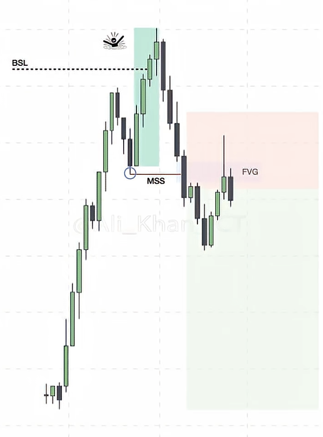

# Smart Money Concepts (SMC) - Reversal Strategy

## Overview
This strategy identifies true reversals using liquidity concepts, displacement, and market structure breaks.

## Visual Reference

**Key elements in the diagram:**
- **BSL** (dotted line) = Buy-Side Liquidity (highs being raided)
- **Green zone** = Displacement candles (strong bearish move)
- **MSS** (circled) = Market Structure Shift (candle closes below swing low)
- **FVG** (pink zone) = Fair Value Gap (entry zone on retracement)

## The 5-Step Reversal Framework

### Step 1: Liquidity Raid
- Price sweeps a significant high (buy-side liquidity) or low (sell-side liquidity)
- This is where retail traders get trapped
- Look for: Stop hunts, equal highs/lows being taken, swing point sweeps

**Signs of a Liquidity Raid:**
- Price spikes through a level then immediately reverses
- Wicks beyond key levels (previous highs/lows)
- Often happens at session highs/lows, equal highs/lows, or trendline touches

### Step 2: Displacement
- Strong, aggressive move AWAY from the liquidity raid
- Usually 2-4 large-bodied candles in succession
- **CRITICAL: Displacement is NOT the entry - it's confirmation of the shift**

**Displacement Characteristics:**
- Large-bodied candles (little to no wicks)
- Moves quickly through price levels
- Creates Fair Value Gaps (FVGs) / Imbalances
- Shows clear institutional intent

### Step 3: Break of Market Structure (BOS)
- Displacement candle CLOSES through the nearest swing point
- For bearish reversal: Close below the nearest swing LOW after raiding highs
- For bullish reversal: Close above the nearest swing HIGH after raiding lows
- **This confirms the algorithm has shifted**

### Step 4: Retracement into FVG + Order Block
- **DO NOT CHASE** - Wait for price to retrace
- Look for retracement into the Fair Value Gap (imbalance)
- Best entries: FVG that overlaps with an Order Block (confluence)

**Fair Value Gap (FVG):**
- Gap between candle 1's low and candle 3's high (bearish)
- Gap between candle 1's high and candle 3's low (bullish)
- Price tends to return to fill these gaps

**Order Block (OB):**
- Last opposing candle before the displacement move
- Bullish OB: Last red candle before bullish displacement
- Bearish OB: Last green candle before bearish displacement

### Step 5: Target Opposing Liquidity
- Target the liquidity pool on the other side
- If you entered short after raiding buy-side, target sell-side liquidity
- Look for: Equal lows, previous swing lows, session lows

---

## Quick Reference Checklist

### Bearish Reversal Setup:
- [ ] Price raids buy-side liquidity (sweeps highs)
- [ ] Displacement candles appear (strong red candles)
- [ ] Candle CLOSES below nearest swing low (BOS confirmed)
- [ ] Wait for retracement into FVG/OB zone
- [ ] Enter SHORT at FVG+OB confluence
- [ ] Target: Sell-side liquidity (lows)
- [ ] Stop: Above the liquidity raid high

### Bullish Reversal Setup:
- [ ] Price raids sell-side liquidity (sweeps lows)
- [ ] Displacement candles appear (strong green candles)
- [ ] Candle CLOSES above nearest swing high (BOS confirmed)
- [ ] Wait for retracement into FVG/OB zone
- [ ] Enter LONG at FVG+OB confluence
- [ ] Target: Buy-side liquidity (highs)
- [ ] Stop: Below the liquidity raid low

---

## One-Sentence Summary
> Liquidity raid → Displacement → Break of Market Structure → Retracement into FVG/OB confluence → Target opposing liquidity pool

---

## Common Mistakes
1. **Chasing displacement** - The move is confirmation, not entry
2. **Entering before BOS** - Wait for candle to CLOSE through structure
3. **Ignoring confluence** - FVG alone is weak; FVG + OB is strong
4. **Forcing reversals** - Let the structure confirm; no BOS = no trade

---

## Timeframe Considerations
- Higher timeframe (HTF): Identify bias and key levels (1H, 4H, Daily)
- Lower timeframe (LTF): Execute entries (1min, 5min, 15min)
- Best practice: HTF liquidity raid → LTF entry in FVG/OB
